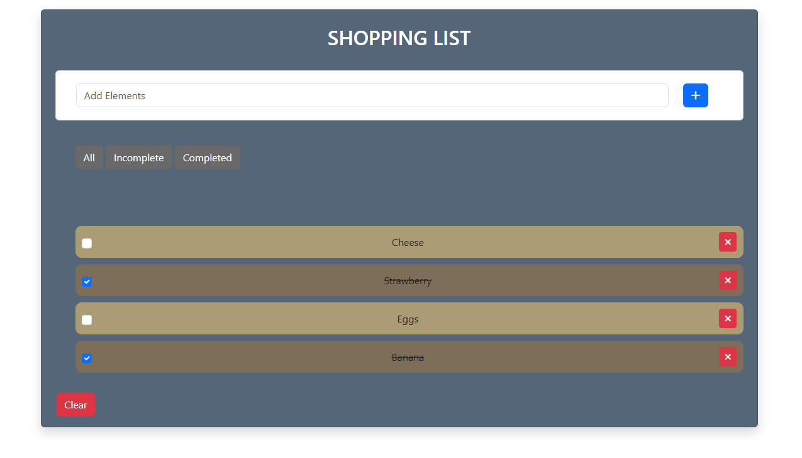
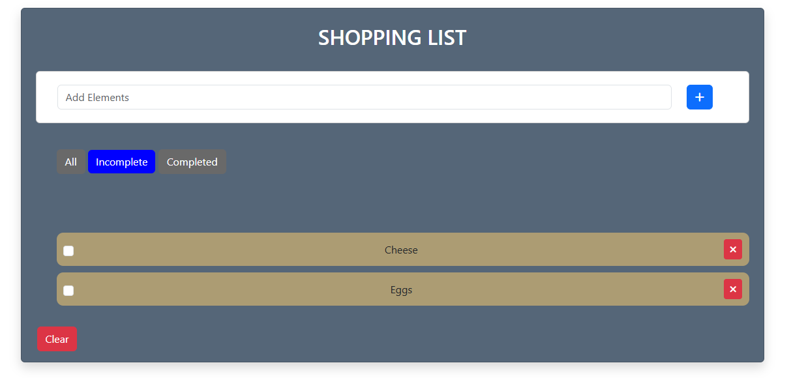
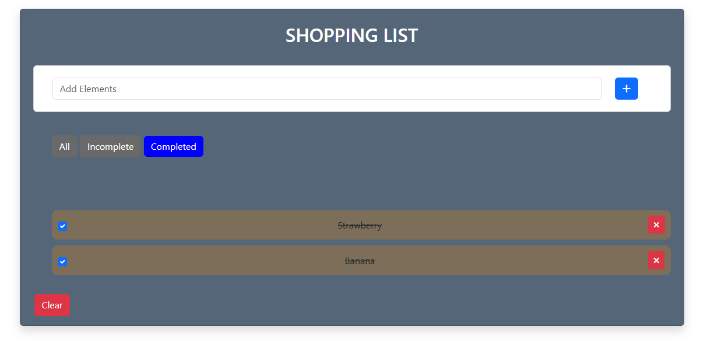
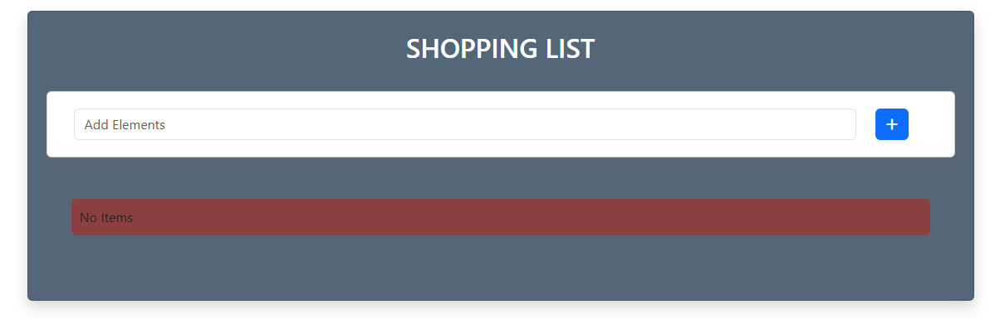

# SHOPPING LIST
In this project, a shopping list was prepared with javascript.

### 1-SHOPPING LIST APPLICATION

#### In this section, I defined functions in the JavaScript part by accessing each operation via HTML name, id, and class attributes. Then, I structured the workflow of the product listing section based on the clicked buttons, creating workflow functions to build the product listing section.

#### I have defined which sections do what work in html, css, javascript files in the comment lines.

#### 1.1- Application Working Logic

#### a- When the page first loads, there are no products.
#### b- As the user adds products, the "no products" warning disappears, and the products are listed.
#### c- When the confirm button is clicked, the product moves under the "Completed" section.
#### d- If the confirm button is removed, the product moves under the "Incomplete" section.
#### e- When the "All" button is clicked, all items become visible.
#### f- When the close button is clicked, the product is removed from all filtering sections.
#### g- The entire product list is cleared with the Clear button.

### 1.2-ShoppingListApplication Images

#### In this section, you can see the changes that have taken place in the sections as a result of using the application.

### 1.3- Sections that can be improved

#### a-When entering the user's page, it will be able to perform operations such as adding, deleting and updating the user's own list with the data entered in the database.
#### b-User data will be stored in the user's browser instead of the database, so that the user can access his data in the fastest way.

